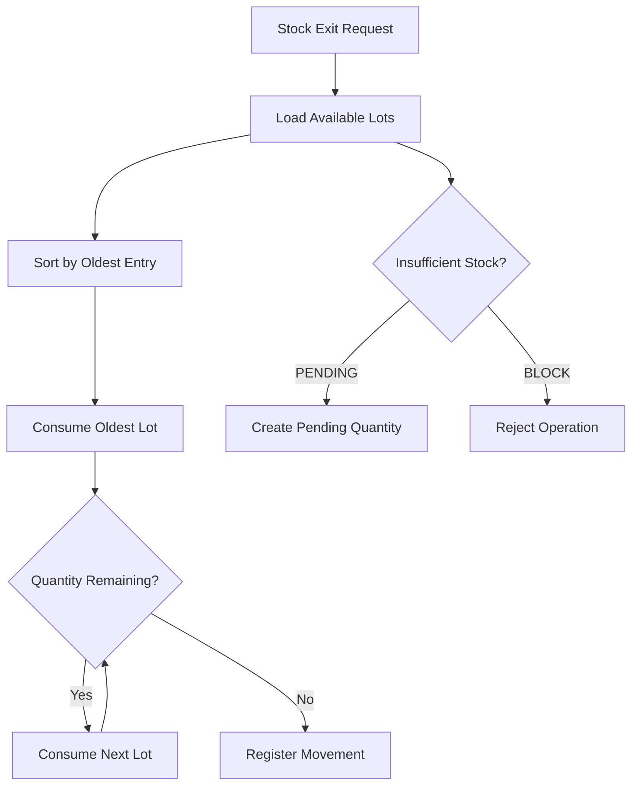

# PEPS Inventory Template

Reusable inventory-management template built with **React and TypeScript**, centered on an isolated **FIFO / PEPS inventory engine** and designed to be adapted to different business domains.

The project separates inventory logic from the user interface and infrastructure, making it possible to reuse the same core for businesses such as hardware stores, mini-markets, pharmacies, spare-parts stores and other inventory-driven operations.

> **Template scope**
>
> This repository is a reusable technical template. Business-specific implementations, credentials, branding and production data are maintained separately.

---

## Overview

The template provides a modular foundation for inventory systems that need to manage stock using **PEPS (Primeras Entradas, Primeras Salidas)**, equivalent to **FIFO (First In, First Out)**.

Its main design goal is to keep the inventory rules independent from React and Firebase so that the core logic can be tested, reused and evolved without being tightly coupled to the interface or persistence layer.

The project includes:

- FIFO / PEPS stock processing
- Strict TypeScript domain models
- Inventory entries and exits
- Batch / lot handling
- Movement history
- Configurable out-of-stock policies
- Pending outputs / backorders
- Tenant-oriented business configuration
- Reusable React components
- Firebase integration layer
- Unit tests for the inventory engine
- Production build support

---

## Core Idea

The inventory engine is intentionally isolated from the UI.

```text
React UI
   ↓
Application / API Layer
   ↓
PEPS Inventory Engine
   ↓
Domain Models
   ↓
Persistence Adapter
```

The core inventory rules can therefore remain independent from:

- React
- Firebase
- UI components
- Routing
- Business branding

This separation makes the project easier to test and adapt.

---

## Main Features

### Isolated PEPS / FIFO Engine

The mathematical logic for processing stock using PEPS is contained inside the core layer.

```text
Oldest available batch
        ↓
Consume stock
        ↓
Continue with next batch
        ↓
Register movement
```

This logic is implemented independently from the visual interface.

---

### Strict TypeScript Domain Model

The main inventory concepts are represented through typed domain models.

Examples include:

- Products
- Lots / batches
- Inventory entries
- Inventory exits
- Movements
- Pending outputs

Strict typing helps detect inconsistencies during development before they reach runtime.

---

### Tenant-Based Configuration

Business-specific behavior can be customized through:

```text
src/config/tenantConfig.ts
```

This allows a new implementation to change selected rules and labels without modifying the inventory engine.

Examples:

- Product labels
- Tax behavior
- Out-of-stock policy
- Business-specific terminology

---

### Generic Inventory Model

The template avoids hard-coding a specific commercial domain.

Instead of forcing domain-specific terms such as:

```text
Medication
```

the core model uses generic concepts such as:

```text
Product
Lot
Entry
Exit
Movement
```

This makes the same codebase easier to adapt to different types of inventory.

---

### Pending Outputs / Backorders

The template supports an optional `PENDING` out-of-stock policy.

When an exit request exceeds available inventory:

```text
Requested quantity
        ↓
Available stock is processed
        ↓
Remaining quantity
        ↓
PENDING
        ↓
Future stock entry
        ↓
Pending quantity can be completed
```

This behavior can be replaced with a strict blocking policy when required.

---

## Architecture

The project applies separation-of-concerns principles inspired by Clean Architecture.

```text
src/
├── api/
│   ├── InventoryController.ts
│   └── DBfirestore.ts
│
├── config/
│   └── tenantConfig.ts
│
├── core/
│   ├── models/
│   │   └── types.ts
│   │
│   ├── services/
│   │   └── PepsEngine.ts
│   │
│   └── __tests__/
│
├── components/
│
├── firebase/
│
├── pages/
│   ├── KardexEntrada.tsx
│   └── KardexSalida.tsx
│
└── utils/
```

### `src/core`

The domain layer.

Contains:

- TypeScript domain models
- PEPS / FIFO calculation logic
- Unit tests

The core layer should not depend on React or Firebase.

### `src/api`

Application and infrastructure adapters.

Examples:

- Inventory controllers
- Persistence adapters
- Firestore integration

### `src/config`

Business-level configuration.

The main customization point is:

```text
tenantConfig.ts
```

### `src/components`

Reusable React UI components.

### `src/pages`

Application views such as:

- Inventory entries
- Inventory exits
- Kardex workflows

### `src/firebase`

Firebase configuration and integration.

Production credentials should be supplied through the corresponding environment or deployment configuration and must not be committed to the public template.

---

## PEPS / FIFO Flow

A simplified stock-exit flow can be represented as:



The exact persistence and transaction strategy can be adapted to the implementation.

---

## Business Configuration

The template can be adapted from:

```text
src/config/tenantConfig.ts
```

Example:

```ts
export const BusinessConfig = {
  // UI label for products:
  // "Product", "Medication", "Article", "Spare Part", etc.
  productLabel: 'Nombre',

  // Example factor for business-specific net-cost calculations.
  TAX_DEDUCTION_FACTOR: 0.87,

  // Behavior when an exit exceeds available stock:
  // 'BLOCK'   -> reject the operation
  // 'PENDING' -> process available stock and keep the remainder pending
  outOfStockPolicy: 'PENDING',
}
```

### Important

The sample tax factor is a configurable business rule, not a universal accounting rule.

Each real implementation should validate its financial and tax calculations according to its own requirements.

---

## Out-of-Stock Policies

### `BLOCK`

Rejects the inventory exit when sufficient stock is not available.

```text
Requested: 10
Available: 7
Result: Operation rejected
```

### `PENDING`

Processes the available quantity and stores the remainder as pending.

```text
Requested: 10
Available: 7

Processed: 7
Pending:   3
```

This is useful for workflows that support backorders or delayed fulfillment.

---

## Typical Inventory Flow

```text
Product Registration
        ↓
Stock Entry
        ↓
Lot Creation
        ↓
Available Inventory
        ↓
Stock Exit
        ↓
PEPS Calculation
        ↓
Movement / Kardex
```

If the configured policy allows pending quantities:

```text
Insufficient Stock
        ↓
Pending Exit
        ↓
New Stock Entry
        ↓
Pending Quantity Processing
```

---

## Tech Stack

### Frontend

- React
- TypeScript
- Create React App

### Data / Infrastructure

- Firebase
- Firestore integration

### Testing

- Jest
- Unit tests for the PEPS engine

### Build

- Create React App production build
- TypeScript compilation
- React JSX transform

---

## Getting Started

Install dependencies:

```sh
npm install
```

Start the development environment:

```sh
npm start
```

Run the test suite:

```sh
npm test
```

Create a production build:

```sh
npm run build
```

---

## Testing

The inventory engine is designed to be testable independently from React.

Tests should focus on behaviors such as:

- Consumption of the oldest lot first
- Partial lot consumption
- Multiple-lot exits
- Insufficient stock
- `BLOCK` policy
- `PENDING` policy
- Pending quantity generation
- Inventory totals
- Movement consistency

The core tests are located under:

```text
src/core/__tests__/
```

---

## Customization

A new implementation will typically customize:

- Business name
- Brand identity
- Product terminology
- Tax rules
- Inventory policies
- Firebase project
- Authentication rules
- Firestore collections
- User roles
- Visual theme
- Additional reports
- Business-specific fields

The PEPS engine should remain as independent as possible from these customizations.

---

## Recommended Template Workflow

This repository is configured as a GitHub **Template Repository**.

Use **Use this template** to create a new independent implementation.

```text
PEPS-Inventory-Template
        ↓
Use this template
        ↓
New private/public implementation
        ↓
Business configuration
        ↓
Own Firebase project
        ↓
Own branding and rules
```

Each implementation should receive its own:

- Firebase project
- Environment configuration
- Business settings
- Branding
- Users
- Production credentials
- Deployment configuration

---

## Security Notes

Before using the template in production:

- Use a dedicated Firebase project
- Review Firestore security rules
- Do not commit credentials
- Validate role permissions
- Protect administrative operations
- Validate inventory updates
- Prefer atomic operations / transactions for stock mutations
- Review tax and financial calculations
- Test concurrent inventory operations
- Validate pending-output behavior for the target business

---

## Future Improvements

Potential improvements for the template include:

- Firestore transaction hardening
- Stronger concurrency controls
- More complete Kardex reports
- Inventory valuation reports
- Configurable units of measure
- Multi-warehouse support
- Product-category management
- Supplier management
- Import / export tools
- Audit logs
- Expanded automated tests
- Migration from Create React App to a more modern build tool

---

## Project Purpose

This repository is published as a reusable technical reference and portfolio project.

It is intended for software development, learning and experimentation.

It should not be treated as a turnkey academic submission or presented as original academic work without substantial independent development and attribution.

---

## Author

**Alfredo Ramos**

Software Engineer  
Full Stack · Mobile · Backend · Data · GIS · Machine Learning

GitHub: [@wolcken](https://github.com/wolcken)  
LinkedIn: [alfredoramos-dev](https://www.linkedin.com/in/alfredoramos-dev/)
